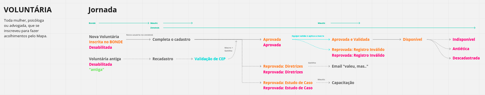

# Integração Mautic x Zendesk

## Como funciona?!

Quando uma pessoa quer se voluntariar no Mapa, o primeiro passo é preencher os dados pessoais (https://queroacolher.mapadoacolhimento.org)[no formulário do BONDE]. Após o preenchimento do formulário uma integração, chamada nesse documento de `BONDE x Zendesk`, cria um novo usuário `Zendesk`, agrupado por `Organização` do tipo voluntária (nesse caso `Advogada` ou `Psicologa`).

Na Pós-Ação do formulário, existe um link para preencher a segunda etapa da inscrição. Esse link direciona a voluntária para etapa de `Triagem` que acontece dentro da plataforma `Mautic`. Esse processo de `Triagem` nos fornece mais informações sobre como a `Voluntária` trabalha e como se qualifica. Este processo as classifica entre as seguintes categorias:

  - reprovada_registro_inválido
  - reprovada_diretrizes_do_mapa
  - reprovada_estudo_de_caso
  - aprovada

Esse funcionamento pode ser visualizado na imagem abaixo:



## Responsabilidade

Essa integração é responsável pelo processo de `Triagem` e considera o preenchimento do formulário na plataforma `Mautic` como um parametro de entrada, no sucesso do formulário `Mautic` um `Webhook` é disparado para este serviço no endpoint `/mautic-zendesk` e o processo de classificação da voluntária se inicia, atualizando suas informações de `Usuária` e criando `Tickets` na plataforma `Zendesk`.

## Como usar?

As seguintes variáveis de ambiente devem ser configuradas:

- ZENDESK_API_URL - url da api do zendesk
- ZENDESK_API_TOKEN - token de autenticação do zendesk
- ZENDESK_API_USER - email do usuário do zendesk pelo qual será feita a autenticação, concatenado com '/token' no fim. EX: email@example.com/token
- PORT - 
- ZENDESK_ORGANIZATIONS - objeto JSON, mapeando as organizações `ADVOGADA`, `MSR` e `PSICOLOGA` com os seus respectivos ids, seguindo o seguinte formato:
```json
{"ADVOGADA":"","MSR":"","PSICOLOGA":""}
```
- GOOGLE_MAPS_API_KEY - token de autenticação do GOOGLE API para realização de chamadas à api do google maps
- WIDGET_IDS - objecti JSON, mapeando o id dos form_entries da comunidade do mapa do acolhimento do bonde, para que seja possível filtrar os form_entries na hora de buscar a data original de inscrição do bonde, seguindo o seguinte formato:
```json
{"ADVOGADA": "", "PSICÓLOGA": ""}
```
- HASURA_API_URL - endpoint da api do HASURA, onde serão salvos os tickets
- X_HASURA_ADMIN_SECRET - chave de segurança de administrador do hasura para autenticação

## Teste

Os testes para a integração mautic-zendesk podem ser realizados manualmente uasando formulários mautic de voluntárias teste para realizar o post no endpoint através de uma ferramenta de teste de requisições como o Postman ou Insomnia para checar se a integração irá ocorrer no Zendesk. 

Um ponto importante para a criação dos fomulários teste é não criar voluntárias que possam ser aprovadas, com todos dados e informações de localização corretas para não atrapalhar o fluxo em produção. Também é bom colocar indicação que são voluntárias teste no nome ou email. 

- Postman: 
https://www.postman.com/

- Insominia: 
https://insomnia.rest

## Show your support

Give a ⭐️ if this project helped you!

## 📝 License

Copyright © 2020 [Nossas <tech@nosssas.org>](https://github.com/nossas).<br />
This project is [AGPL--3.0](https://github.com/nossas/mapa-do-acolhimento/blob/main/LICENSE) licensed.